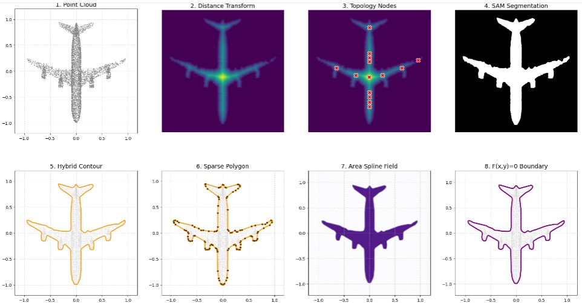

# NeuSOGA

[](LICENSE) 
[](https://doi.org/10.48550/arXiv.2609.01408))
[](
https://doi.org/10.48550/arXiv.2609.01408)

**Observation → Topology → Geometry → Symbol**

A neuro-symbolic framework for transforming observations into
explicit symbolic mathematical representations.

**From Observations to Symbolic Mathematical Representations**

NeuSOGA is a neuro-symbolic framework for transforming observations into explicit symbolic mathematical representations through topology-guided geometric abstraction.

The framework implements the abstraction hierarchy:

```text
Observation (O)
        ↓
Topology (T)
        ↓
Geometry (G)
        ↓
Symbol (S)
```

where observations are progressively transformed into topological abstractions, geometric abstractions, and ultimately symbolic mathematical representations.

<p align="center">
  
  <em>Overview of the NeuSOGA framework.</em>
</p>

---

# Research Motivation

Many modern AI systems achieve impressive perceptual performance by learning latent representations from large-scale data. While effective for recognition and prediction, such representations are often difficult to interpret, manipulate, or analyse directly.

NeuSOGA explores an alternative paradigm:

```text
Observation
      ↓
Topology
      ↓
Geometry
      ↓
Symbol
```

Rather than learning geometry exclusively through statistical optimization, NeuSOGA extracts topology-aware structure, performs adaptive geometric abstraction, and synthesizes explicit symbolic mathematical representations through analytical geometry.

The central research question is:

> How can symbolic mathematical representations emerge from observations through a neuro-symbolic abstraction process?

---

# NeuSOGA Pipeline

NeuSOGA follows a four-stage abstraction hierarchy.

## 1. Observation (O)

Geometric observations are acquired from point clouds or projected views.

Current implementation supports:

- ModelNet40 point-cloud objects
- Arbitrary-view projections
- Normalized geometric observations

The observation layer provides the raw spatial data from which symbolic representations are ultimately constructed.

---

## 2. Topology (T)

Intrinsic structure is extracted through topology-guided analysis.

NeuSOGA computes:

- Euclidean Distance Transforms (EDT)
- topology-aware structural cores
- distance-field maxima
- internal void structures
- global spatial organization

The resulting topology nodes provide compact abstractions of object structure and subsequently guide perception.

---

## 3. Geometry (G)

Topology-aware structure is transformed into sparse geometric abstractions.

The geometry stage combines:

- topology-guided Segment Anything (SAM) prompting
- contour extraction
- adaptive multi-scale scale-space abstraction
- hybrid coarse-to-fine boundary refinement
- sparse control-polygon generation

Dense geometric observations are compressed into compact and interpretable geometric representations while preserving important structural detail.

---

## 4. Symbol (S)

The symbolic stage converts geometric abstractions into explicit mathematical representations.

NeuSOGA employs Implicit Area Splines to generate:

- analytical implicit representations
- arbitrary-order smoothness
- additive composition
- closed-form evaluation
- symbolic geometric models

The final representation is expressed as:

```text
F(x,y) = 0
```

providing an explicit symbolic description of the observed shape.

---

# Repository Contents

```text
NeuSOGA/
│
├── assets/
│   └── figures/
│
├── demo/
│   └── neusoga_demo.py
│
├── notebooks/
│
├── paper/
│
├── README.md
├── requirements-demo.txt
├── LICENSE
└── CITATION.cff
```

The repository contains the reference implementation accompanying the NeuSOGA paper.

---

# Installation

## 1. Clone the Repository

```bash
git clone https://github.com/QL-UoHull/NeuSOGA.git

cd NeuSOGA
```

## 2. Create a Python Environment

### Linux / macOS

```bash
python -m venv .venv

source .venv/bin/activate

python -m pip install --upgrade pip

pip install -r requirements-demo.txt
```

### Windows

```cmd
python -m venv .venv

.venv\Scripts\activate

python -m pip install --upgrade pip

pip install -r requirements-demo.txt
```

---

# External Resources

## ModelNet40 Dataset

ModelNet40 is not bundled with this repository.

The NeuSOGA demo automatically downloads and extracts the dataset when executed for the first time.

Users may also substitute their own point-cloud datasets if desired.

## Segment Anything (SAM)

NeuSOGA employs topology-guided perception using Meta's Segment Anything Model (SAM).

Download the required checkpoint:

```text
sam_vit_b_01ec64.pth
```

and place it in the working directory before execution.

Checkpoint source:

https://github.com/facebookresearch/segment-anything

## Hardware

The implementation automatically detects:

```text
CPU
CUDA GPU
```

execution environments.

A GPU is not required for reproducibility but significantly accelerates large-scale experiments.

---

# Running NeuSOGA

Execute:

```bash
python demo/neusoga_demo.py
```

The script automatically:

1. Downloads ModelNet40 if required.
2. Loads SAM.
3. Processes representative objects from all 40 ModelNet40 categories.
4. Generates arbitrary-view projections along:

```text
[1,1,1]
```

5. Executes the complete:

```text
O → T → G → S
```

abstraction pipeline.

---

# Outputs

Results are written to:

```text
robustness_results/
```

For each object, NeuSOGA generates an eight-stage visualization illustrating:

```text
1. Observation (O)
2. Euclidean Distance Transform
3. Topology Nodes (T)
4. Topology-Guided Segmentation
5. Scale-Space Contour
6. Control Polygon (G)
7. Area Spline Field
8. Symbolic Boundary F(x,y)=0 (S)
```

These visualizations provide a transparent illustration of how symbolic mathematical representations emerge from geometric observations.

---

# Robustness Evaluation

The current implementation evaluates NeuSOGA across:

- 40 object categories from ModelNet40
- non-canonical viewing directions
- arbitrary-view projection geometry
- topology-aware segmentation
- symbolic representation generation

The generated visualizations demonstrate the stability of the abstraction hierarchy across diverse object classes and viewing conditions.

---

# Explainability by Construction

A central objective of NeuSOGA is explainability through explicit representation.

Unlike conventional latent neural representations, every stage of the abstraction hierarchy remains observable:

```text
Observation
      ↓
Topology
      ↓
Geometry
      ↓
Symbol
```

The generated symbolic models can be inspected, edited, analysed, and evaluated directly through their mathematical representation.

---

# Paper

**Neuro-Symbolic Geometric Abstraction (NeuSOGA): From Observations to Symbolic Mathematical Representations**

arXiv:

```text
arXiv:2609.01408
```

(Update if the identifier changes.)

---

# Citation

```bibtex
@article{li2026neusoga,
  title={Neuro-Symbolic Geometric Abstraction (NeuSOGA):
         From Observations to Symbolic Mathematical Representations},
  author={Li, Qingde},
  journal={arXiv preprint arXiv:2609.01408},
  year={2026}
}
```

---

# License

This repository is distributed under the MIT License.

See `LICENSE` for details.
